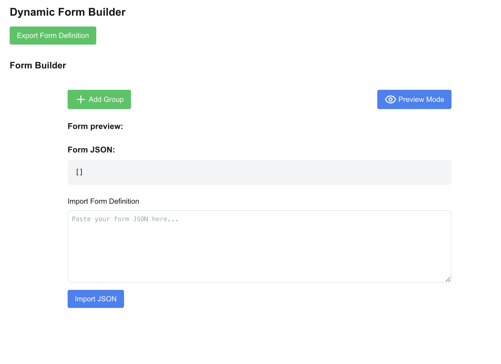

# Dynamic Form Builder

A powerful and flexible React form builder that allows you to create dynamic forms with conditional logic, validation, and real-time preview.



## Features

- 📝 Drag-and-drop field reordering
- 🎯 Multiple field types supported:
  - Text
  - Number
  - Email
  - Select
  - File Upload
  - Radio
  - Checkbox
  - Calendar (Date)
- 🔄 Real-time form preview
- ⚡ Conditional logic for field visibility and requirements
- 📱 Responsive design
- 🎨 Clean, modern UI using Tailwind CSS
- 💾 Import/Export form definitions as JSON
- ✨ Field validation
- 🔍 Preview mode for testing form behavior

## Installation

```bash
# Clone the repository
git clone https://github.com/yourusername/dynamic-form-builder.git

# Navigate to the project directory
cd dynamic-form-builder

# Install dependencies
npm install

# Start the development server
npm run dev
```

## Usage

### Basic Form Creation

1. Click "Add Group" to create a new form section
2. Add fields to the group using the "Add Field" button
3. Configure field properties:
   - Label
   - Field type
   - Required/Optional
   - Visibility conditions
   - Validation rules

### Conditional Logic

Fields can be made required or visible based on other field values:

```javascript
{
  "required_if": [
    {
      "field": "employment_status",
      "operator": "equals",
      "value": "employed"
    }
  ],
  "visible_if": [
    {
      "field": "has_pets",
      "operator": "equals",
      "value": "true"
    }
  ]
}
```

### Field Types

- **Text**: Standard text input
- **Number**: Numeric input with validation
- **Email**: Email input with format validation
- **Select**: Dropdown with customizable options
- **File**: File upload with type and size restrictions
- **Radio**: Radio button group
- **Checkbox**: Single checkbox input
- **Date**: Calendar date picker

### Import/Export

Forms can be exported as JSON for saving or sharing:

```javascript
{
  "groups": [
    {
      "name": "Personal Information",
      "description": "Basic details",
      "fields": [
        {
          "name": "full_name",
          "type": "text",
          "label": "Full Name",
          "required": true
        }
        // ... more fields
      ]
    }
    // ... more groups
  ]
}
```

## Components

### Key Components

- `FormBuilder`: Main component for building forms
- `FieldBuilder`: Handles individual field configuration
- `FormPreview`: Renders the live form preview
- `JsonPreview`: Handles JSON import/export functionality

### Props

#### FormBuilder

```javascript
interface FormBuilderProps {
  formDefinition: FormDefinition;
  onChange: (newDefinition: FormDefinition) => void;
}
```

#### FieldBuilder

```javascript
interface FieldBuilderProps {
  group: Group;
  groupIndex: number;
  field: Field;
  fieldIndex: number;
  onUpdateField: (groupIndex: number, fieldIndex: number, field: Field) => void;
  onRemoveField: (groupIndex: number, fieldIndex: number) => void;
  onAddCondition: (groupIndex: number, fieldIndex: number, type: string) => void;
  onRemoveCondition: (groupIndex: number, fieldIndex: number, type: string, conditionIndex: number) => void;
  onDragField: (sourceIndex: number, targetIndex: number) => void;
}
```

## Styling

The project uses Tailwind CSS for styling. Custom styles can be added by modifying the Tailwind configuration or adding custom CSS classes.

## Contributing

1. Fork the repository
2. Create your feature branch (`git checkout -b feature/AmazingFeature`)
3. Commit your changes (`git commit -m 'Add some AmazingFeature'`)
4. Push to the branch (`git push origin feature/AmazingFeature`)
5. Open a Pull Request

## License

This project is licensed under the MIT License - see the [LICENSE.md](LICENSE.md) file for details.

## Acknowledgments

- Built with React and Tailwind CSS
- Icons provided by Lucide React
- Drag and drop functionality using native HTML5 API